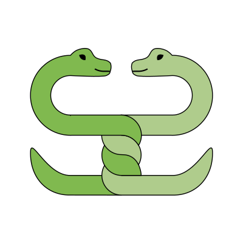

# Python 3 Grundlagen

Dies ist eine Sammlung von Python-Übungsaufgaben für Einsteiger.

## Für wen sind die Übungen geeignet?

Diese Aufgaben sind für Dich geeignet, wenn

* Du überhaupt noch nie programmiert hast.
* Du bereits erste Erfahrungen mit einer anderen Programmiersprache wie R, MATLAB oder C hast.
* Du Lehrer bist und Übungsaufgaben für Deinen eigenen Python-Kurs suchst.

Wenn Du noch nie programmiert hast, wirst Du ein Buch, einen Trainer oder eine Lerngruppe brauchen.

Ich empfehle als Begleitbuch das kostenlos verfügbare [Think Python](https://greenteapress.com/wp/think-python-2e/).

----

## Teil 1: Erste Schritte

* [Python Installieren](installation.md)
* [Dein erstes Programm](hallo.md)
* [Python als Taschenrechner](taschenrechner.md)
* [Pythagoras](pythagoras.md)
* [Schere-Stein-Papier](if.md)
* [Schildkrötengrafik](schildkroete.md)
* [Zahlenraten](zahlenraten.md)
* [Funktionen plotten](funktionen_plotten.md)
* [Dictionaries](chiffre.md)
* [Reguläre Ausdrücke](regex.md)

----

## Teil 2: Datenanalyse – Babynamen

* [Babys auszählen](projekt_babynamen/babys_auszaehlen.md)
* [Namen finden](projekt_babynamen/namen_finden.md)
* [Eine Zeitreihe erstellen](projekt_babynamen/zeitreihe.md)
* [Tabellen ausgeben](projekt_babynamen/tabelle_ausgeben.md)
* [Anfangsbuchstaben zählen](projekt_babynamen/zaehlen.md)

----

## Teil 3: Datenanalyse mit pandas – Gapminder

* [Einstieg in pandas](projekt_gapminder/pandas_grundlagen.md)
* [Balkendiagramme plotten](projekt_gapminder/balkendiagramm.md)
* [Histogramme plotten](projekt_gapminder/histogramm.md)
* [Animierter Scatterplot](projekt_gapminder/long_wide_tables.md)
* [pandas Kurzreferenz](projekt_gapminder/cheatsheet.md)
* [Weltkarte](challenges/weltkarte.md)

----

## Teil 4: Maschinelles Lernen

* [Panik auf der Titanic](projekt_titanic/README.md)
* [Songtexte klassifizieren](projekt_lyrics.md)
* [Machine Learning Kurzübersicht](ml_glossar.md)

----

## Teil 5: Webentwicklung – Strassenverzeichnis

* [Webseite mit Strassennamen](projekt_website/website.md)

----

## Teil 6: Spiele Programmieren

* [Flucht aus dem Labyrinth](labyrinth.md)

----

## Allgemeine Programmiertips

* [Das Impostor Syndrome](impostor.md)

## Wiederholungsübungen

* [Datentypen](datentypen.md)

----

### Anhang

* [Empfohlene Bücher und Webseiten](appendix/literatur.md)
* [Links](appendix/links.md)
* [Hinweise für Lehrkräfte](appendix/teaching.md)
* [Hintergrundinformationen zu Python 3](appendix/hintergrundinfos.md)

----

## Quelltext

Die Quellen dieses Dokuments sind unter [https://github.com/krother/python3_grundlagenkurs](https://github.com/krother/python3_grundlagenkurs) verfügbar.

## Lizenz

© 2015 Dr. Kristian Rother (krother@academis.eu)

mit Einzelbeiträgen von Allegra Via, Kaja Milanowska und Anna Philips

Verteilt unter den Bedingungen der Creative Commons Attribution Share-alike License 4.0

## Danksagungen

Ich möchte den folgenden Leuten für den anregenden Austausch zu Python und Bildung danken: Jasmin Touati, Veit Schiele, Dinu Gherman, Pedro Fernandes, Tomasz Puton, Edward Jenkins, Bernard Szlachta, Robert Lehmann und Magdalena Rother.
Ihr habt dazu beigetragen, dieses Tutorial zu verbessern.
