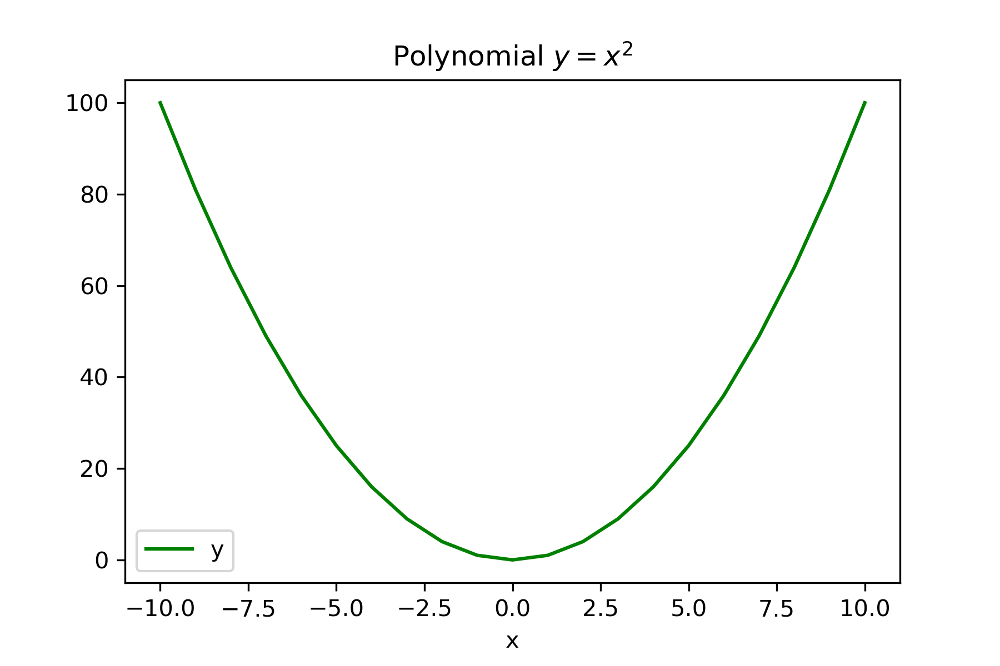

# Funktionen plotten

In diesem Kapitel lernst Du:

* Diagramme zu zeichnen
* Daten in einer Liste abzulegen
* Listen von Zahlen zu erzeugen
* Die Dokumentation zu verwenden
* Ein Flußdiagramm zu lesen

In diesem Kapitel verwenden wir die Bibliothek `matplotlib`, um  einfache Diagramme zu erzeugen und Funktionen zu plotten.

### Aufgabe 1

Führe folgendes Programm aus:

    from matplotlib import pyplot as plt

    x = [1, 2, 3, 4, 5]
    y = [2, 5, 7, -3, 9]

    plt.plot(x, y)

### Aufgabe 2

Ersetze `plot` nacheinander durch folgende Funktionen:

* `bar(x, y)`
* `scatter(x, y)`
* `pie(x)`

### Aufgabe 3

Folgendes Programm enthält einen Fehler. Finde und behebe ihn.

    from matplotlib import pyplot as plt

    plt.scatter([4, 2, 4], [4, 4, 2, 2])

## Anweisungen wiederholen

Bisher wurde in unseren Programmen jede Anweisung genau ein Mal ausgeführt. In diesem Abschnitt werden wir uns die `for`-Anweisung genauer anschauen, mit der wir einen oder mehrere Befehle wiederholt als **Schleife** ausführen können.

### Aufgabe 4

Was tut das folgende Programm?

    for zahl in range(1, 7):
        print(zahl)

### Aufgabe 5

Erkläre, warum die `for`-Anweisung besser als der folgende Ansatz ist:

    print(1)
    print(2)
    print(3)
    print(4)
    print(5)
    print(6)

### Aufgabe 6

Erkläre den Unterschied zwischen folgenden zwei Programmen:

    fakultaet = 1
    for i in range(10):
        fakultaet = fakultaet * i
        print(fakultaet)

und

    fakultaet = 1
    for i in range(10):
        fakultaet = fakultaet * i
    print(fakultaet)

### Aufgabe 7

Schreibe eine Schleife mit `for`, welche folgende Ausgabe produziert:

    1
    4
    9
    16
    25
    36
    49

### Aufgabe 8

Nun haben wir alle Bestandteile, die wir benötigen, um eine *Parabel* zu zeichnen.
Fülle die Lücken im Programm:

    from ____ ____ pyplot as ____

    x = ____
    y = []

    for i in ____(-10, 10):
        x.append(i)
        y.append(____)

    plt.____(x, y)

### Aufgabe 9

Schreibe ein Programm, das eine Sinusfunktion zeichnet. Verwende die Funktion:

    import math

    rad = 3.14159
    math.sin(rad)

#### Hinweis:

Um eine hohe Auflösung zu erhalten, kannst Du `range` bis 100 oder mehr laufen lassen und bei der Berechnung des Winkels durch 10 oder mehr teilen.

----

### Aufgabe 10

Welche der folgenden Befehle sind ausführbar?

* `for char in "ABCD": print(char)`
* `for i in range(10): print(i)`
* `for k in 7.65: print(k)`
* `for number in [4, 6, 8]: print(number)`
* `for x, y in [(1,2), (3,4), (5,6)]: print(x, y)`
* `for (i=0; i<10; i++): print(i)`
