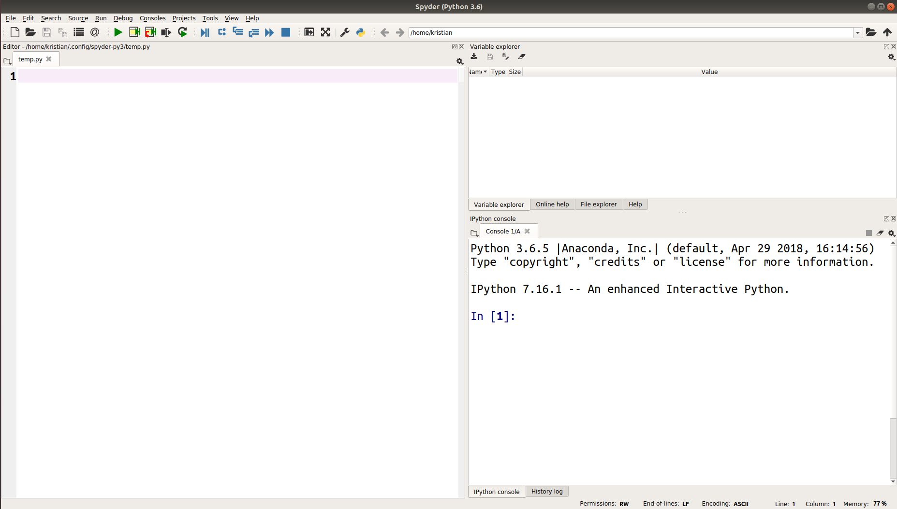

# Python installieren

## In diesem Kapitel lernst Du:

| Bereich | Thema |
|---------|-------|
| 🔧 | Anaconda installieren
| 🔧 | den Editor Spyder starten |
| 🔧 | Spyder bedienen |
| 💼 | eine Python-Anweisung ausführen |

----

## Python

Der erste Schritt in die Welt des Programmierens ist, Python auf Deinem Computer zu installieren.
In diesem Kurs verwenden wir [**Python 3**](https://www.python.org).

Die Python-Distribution [**Anaconda**](https://www.anaconda.com/products/individual) enthält Python 3 und viele Zusatzpakete.
Damit ist Anaconda hervorragend zur Datenanalyse und für wissenschaftliche Anwendungen geeignet.

### Aufgabe 1: Anaconda installieren

Anaconda läuft auf allen gängigen Betriebssystemen.
Du kannst die Aufgaben unter Linux, Windows oder MacOS bearbeiten.

Die genaue Installation hängt von Deinem Betriebssystem ab.

Folge den Anweisungen auf der [**Anaconda-Webseite**](https://www.anaconda.com/products/individual)

----

### Aufgabe 2: Den Editor Spyder starten

Der in Anaconda enthaltene Editor **Spyder** hilft beim Entwickeln kleiner und mittelgroßer Programme.
Er enthält viele Zusatzfunktionen, die bei der Fehlersuche helfen.

#### Spyder unter Windows starten

1. Suche im Startmenü nach dem *Anaconda Navigator*
2. Klicke die Dialogfenster weg, die beim ersten Mal erscheinen
3. Starte **Spyder** aus dem Navigator-Fenster

#### Spyder unter MacOs starten

1. Starte den *Anaconda Navigator* aus der Programmleiste (ein grüner Kreis)
2. Starte **Spyder** aus dem Navigator-Fenster

#### Spyder unter Ubuntu Linux starten

1. Öffne eine Kommandozeile (mit `Strg + T`)
2. tippe `spyder` und drücke die Eingabetaste

----

## Aufgabe 3: Die Spyder-Oberfläche kennen lernen

Wenn alles geklappt hat, sollte Dein Bildschirm etwa so aussehen:

:::quiz spyder_quiz.json

## Aufgabe 4: Eine Python-Anweisung ausführen

Tippe folgende Rechnung in das **Editorfenster**:

    :::python3
    1 + 1

Führe die Anweisung mit dem **Programm ausführen**-Knopf aus.

Du solltest das Ergebnis in der **Konsole** sehen.

**Wenn Du es bis hier geschafft hast, geht es jetzt richtig los!**
